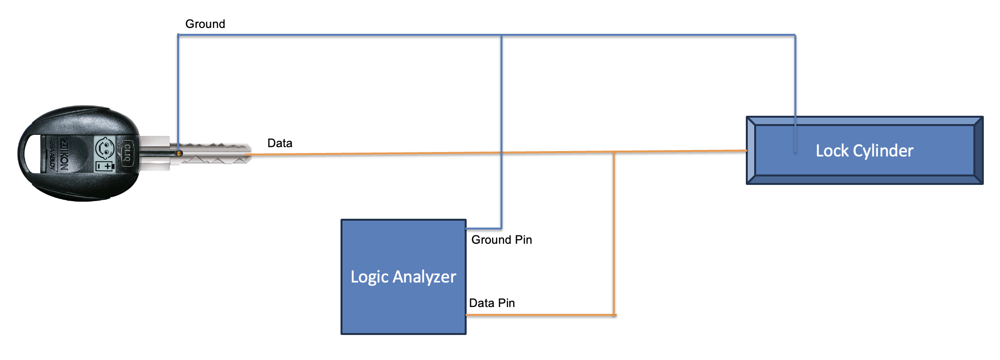
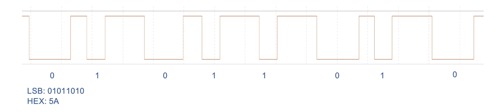
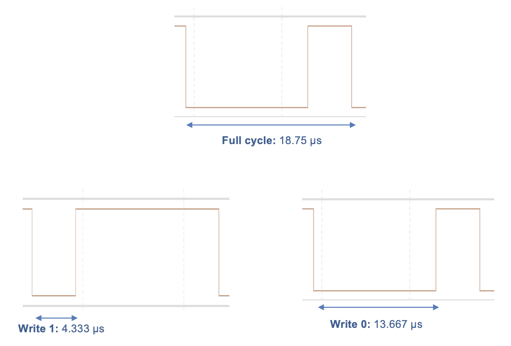
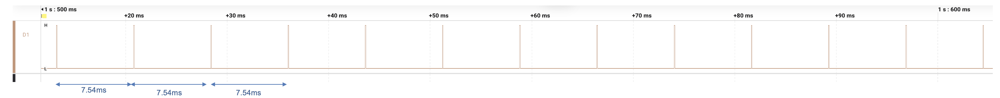
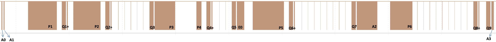
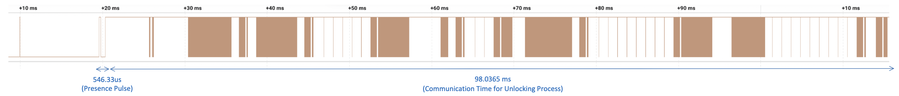
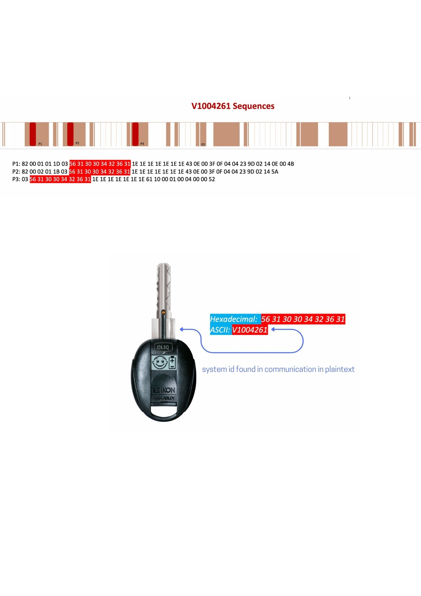

# Forwarding-Attack on a Mechatronic Locking System

This repository contains the tools, scripts, signal data, and figures used to analyze and decode communication between a key and a mechatronic lock using the 1-Wire protocol.

**Author**: Md Towhidul Ahmed  

---

## Objectives

- Demonstrate the feasibility of forwarding attacks on a 1-Wire-based locking system.
- Analyze communication between the key and the lock to identify security flaws.
- Evaluate existing protective mechanisms.
- Provide risk assessments and suggest cryptographic countermeasures.

---

## What is a Forwarding Attack?

A forwarding attack is a security breach where an adversary intercepts and relays or modifies communication between two devices without their knowledge. These attacks are effective against weak or partially protected communication protocols.

---

## Test Environment

- **Lock System**: ASSA ABLOY VERSO® CLIQ
- **Key**: System ID `V1004261`, contact pins, embedded display
- **Protocol**: 1-Wire (Key acts as Master, Lock as Slave)
- **Test Setup**: Communication captured between the key and the lock during real unlocking attempts using a logic analyzer

---

## Tools Used

- PicoScope for signal voltage testing
- Logic Analyzer for capturing communication signals
- Raspberry Pi for GPIO testing with 1-Wire support
- Breadboard and jumper wires
- Physical test environment using mechanical key interface

---

## Data

The `data/sample_csvs/` folder contains CSV files with captured 1-Wire communication between key and lock.  
Each file contains two columns:

- Column 1: Timestamp (in seconds or milliseconds)
- Column 2: Digital signal level (0 or 1)

Example files include unlocking attempts with different keys, locks, and timestamps to analyze repeatability and time-related changes.

---

## Figures and Analysis

The `docs/waveform_analysis/` directory contains figures used in the analysis:

- `connection_diagram.png`: Shows how the logic analyzer is connected between the key and the lock to intercept the communication.
  
*Figure: How to connect the logic analyzer between the lock and key to capture communication signals.*

- `8bit_decoding.png`: Demonstrates decoding logic for 1-Wire protocol — long low pulse indicates binary 0, short low pulse indicates binary 1.
  
*Figure: Decoding signal according to the 1-Wire protocol. Long low pulse = 0, short low pulse = 1.*

- `full_cycle.png`: Shows a full 1-Wire communication cycle — low pulse durations (13.66 µs = 0, 4.333 µs = 1) and full cycle time (18.75 µs).
  
*Figure: Full cycle duration is 18.75 µs. Long low pulse of 13.66 µs = 0, short low pulse of 4.333 µs = 1.*

- `Key's_behaviour_reset_signal.png`: Shows how the key continuously sends reset pulses, indicating repeated attempts to initiate communication.
  
*Figure: The key continuously sends reset pulses during idle communication.*

- `mapping_chuncks_A,P,Q.png`: Visual aid to label and map segments like A1, A2, P1, Q1–Q9 for better communication structure analysis.
  
*Figure: Labeled chunks A1, P1–P2, Q1–Q21 for organized pattern analysis.*

- `unclocking_time_analysis.png`: Illustrates the total time (~98.0365 µs) taken for a complete unlocking process.
  
*Figure: Time taken to complete unlock communication measured as ~98.0365 µs.*

- `vulnerability_found_in_comm.png`: Captures the System ID (`V1004261`) found in plaintext within communication — a major vulnerability.
  
*Figure: System ID "V1004261" found in plaintext — indicates a critical vulnerability.*

---

## Communication Analysis Summary

- The key initiates communication via reset pulses.
- Binary values are decoded from pulse durations.
- Repetitive structures were found in sequences like A1–A3 and Q1–Q9.
- Key ID and Lock ID segments (e.g., P1, P2, P3) reveal static and dynamic parts.
- Time-dependent fields and changing last-byte values suggest the use of nonces or checksums.
- In some cases, over 70% of the data was identical across different unlocking events, indicating high predictability.

---

## Vulnerability Summary

- **Exposed System ID**: Plaintext string `V1004261` found within communication frames.
- **Predictable Structure**: Repeated sequences make replay or predictive attacks feasible.
- **Partial Encryption**: Only parts of the sequence appear to be dynamic or hashed.

---

## Recommendations

- Encrypt the entire communication payload instead of just selected fields.
- Avoid transmitting static identifiers (like system ID) in plaintext.
- Introduce session-specific tokens and cryptographic handshakes to prevent replay and forwarding attacks.

