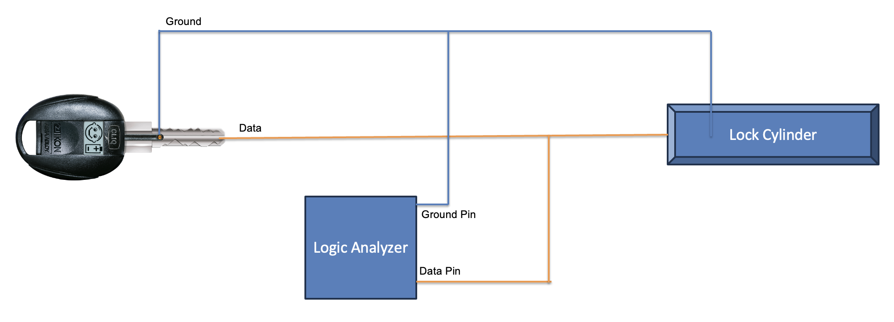
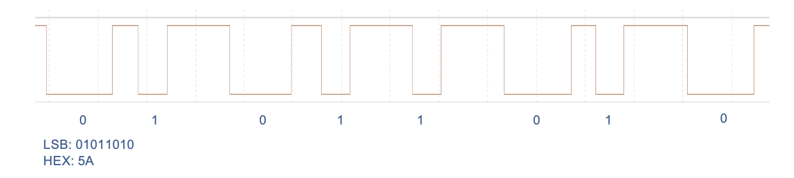
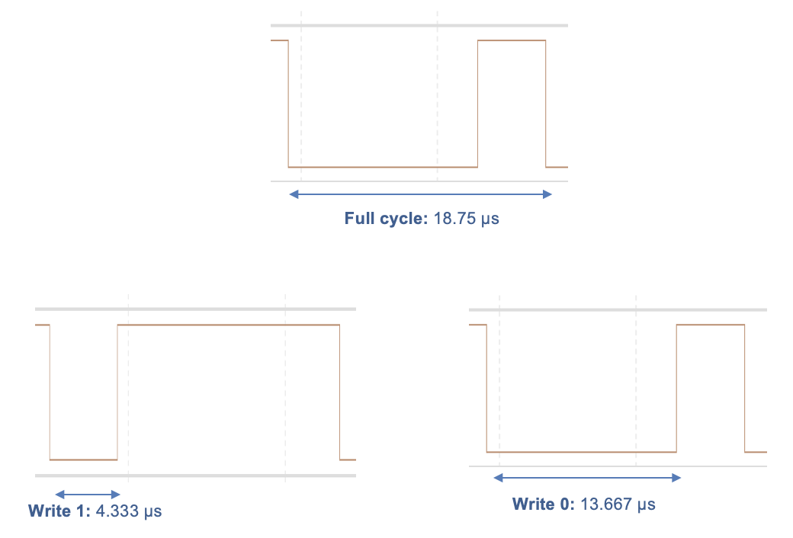
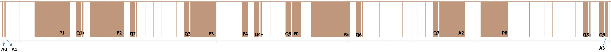
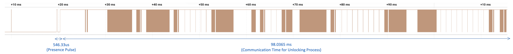
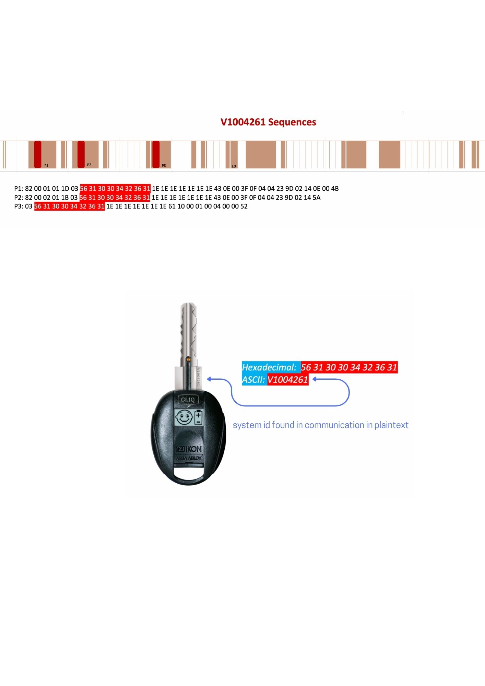

# Forwarding-Attack on a Mechatronic Locking System

**Author**: Md Towhidul Ahmed

This project investigates the security of a mechatronic locking system that relies on the 1-Wire protocol for key-lock communication. The main goal was to find out whether a forwarding attack is practically feasible against this kind of system. In such an attack, an adversary intercepts and relays the signal between key and lock without either device noticing. All the scripts, captured signal data, and analysis figures used during the research are collected here.

---

## Background and Motivation

Mechatronic locks combine mechanical and electronic elements, and many of them depend on short-range wired protocols like 1-Wire to authenticate a key. In theory, this should be secure enough for physical access control. But during initial testing, it became clear that the protocol implementation on the lock under study left room for exploitation.

A forwarding attack (sometimes called a relay attack) works by placing an adversary in the communication path between two legitimate devices. The attacker does not need to understand the content of the messages. Simply forwarding them at the right time can be enough to trick the system. This is especially dangerous when the protocol lacks proper session-based authentication or encryption.

The research set out to:
- Capture and decode real communication between a key and lock
- Identify which parts of the data are static vs. dynamic across sessions
- Assess how much of the protocol is protected (or not)
- Outline practical countermeasures

---

## Test Setup

The lock used for this study is an **ASSA ABLOY VERSO® CLIQ** system. The key carries System ID `V1004261`, has contact pins and a small embedded display. Communication follows the 1-Wire protocol, where the key acts as master and the lock as slave.

To capture the signals, a logic analyzer was connected in-line between the key and lock contacts during real unlocking attempts. A PicoScope was also used early on to characterize voltage levels and timing. Some additional GPIO-level tests were run on a Raspberry Pi to better understand 1-Wire behaviour outside the lock context.

**Hardware used:**
- PicoScope (voltage and timing characterization)
- Logic Analyzer (signal capture during unlock events)
- Raspberry Pi (GPIO-based 1-Wire experimentation)
- Breadboard, jumper wires, and a mechanical key interface adapter

---

## Captured Data

Raw signal captures are stored in `data/sample_csvs/`. Each CSV has two columns: a timestamp and a digital level (0 or 1). Multiple unlock sessions were recorded using different keys, locks, and at different times, so that repeatability and time-dependent variations could be studied.

---

## Signal Analysis and Figures

All figures referenced below are in `docs/waveform_analysis/` (connection diagram is in `docs/diagram/`).

### Connection Setup

The logic analyzer sits between the key and lock contacts to passively tap the communication line.

  
  
<em>How the logic analyzer was wired between the lock and key for signal capture.</em>

### Bit-Level Decoding

1-Wire encodes bits through pulse duration: a long low pulse represents a binary 0, a short low pulse represents a 1. The figure below shows this in practice on captured data.

  
  
<em>Decoding individual bits from the 1-Wire signal. Long low = 0, short low = 1.</em>

### Full Cycle Timing

A single bit cycle takes about 18.75 µs. Within that, a low pulse of ~13.66 µs encodes a 0, while ~4.333 µs encodes a 1. These timings were consistent across all captures.

  
  
<em>Full cycle duration measured at 18.75 µs. Low pulse of 13.66 µs = 0, 4.333 µs = 1.</em>

### Key Idle Behaviour

When no lock is present (or during idle), the key continuously sends reset pulses, essentially polling for a slave device. This is standard 1-Wire behaviour but worth noting for timing analysis.

  
  
<em>The key sends repeated reset pulses while waiting for a lock to respond.</em>

### Sequence Mapping

To make sense of the full communication, the data stream was segmented into labeled chunks: A1, A2 for initial exchanges, P1–P2 for identification-related fields, and Q1–Q21 for the main data payload. This labeling made it much easier to compare sessions side by side.

  
  
<em>Labeled chunks (A, P, Q segments) used for structured comparison across sessions.</em>

### Unlock Duration

The entire unlock communication, from the first reset pulse to the final acknowledgement, takes roughly 98 µs. This is fast enough that an attacker with decent hardware could relay it in real time.

  
  
<em>Total unlock communication duration: approximately 98.04 µs.</em>

### Plaintext System ID

One of the more concerning findings: the System ID (`V1004261`) appears in plaintext within the captured data. The raw hex bytes `56 31 30 30 34 32 36 31` decode directly to ASCII characters, revealing the full system identifier. Anyone with a logic analyzer and physical access to the key contacts can read it.

  
  
<em>System ID "V1004261" transmitted in the clear, with no encryption or obfuscation.</em>

---

## What the Analysis Showed

After decoding and comparing multiple unlock sessions, a few things stood out:

- The key always initiates with reset pulses, then the lock responds. This follows standard 1-Wire master/slave behaviour.
- Segments A1–A3 and large portions of the Q-blocks were nearly identical across sessions. In some comparisons, over 70% of the payload was unchanged between different unlock events.
- Certain fields (P1, P2, P3) appear to carry key and lock identifiers. Parts of these are static, while others change between sessions, possibly serving as nonces or checksums.
- The last byte in several segments varied between sessions, which hints at some form of rolling value. However, this alone is not enough to prevent replay if the rest of the payload is predictable.

In short, the communication is highly structured and largely predictable. This makes it vulnerable to both replay and forwarding attacks.

---

## Key Vulnerabilities

- **System ID in plaintext**: The string `V1004261` is readable directly from the wire, with no encryption or masking.
- **High payload similarity**: Most of the data does not change between sessions, making replay straightforward.
- **Incomplete protection**: Only a small fraction of the exchanged bytes appear to be dynamic or authenticated. The rest is static and predictable.

---

## Suggested Countermeasures

Based on the findings, a few practical steps would significantly raise the bar for an attacker:

- **Full payload encryption**: Rather than protecting only selected fields, the entire communication should be encrypted end-to-end.
- **No plaintext identifiers**: Static values like the system ID should never be sent in the clear. They should be part of an encrypted or hashed exchange.
- **Session-based authentication**: Each unlock attempt should involve a fresh cryptographic challenge-response (e.g., using a nonce and HMAC), making previously captured sessions useless for replay.

